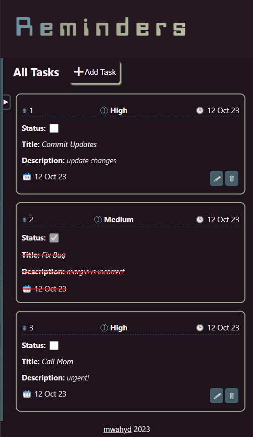

# Project: Reminders

[Live demo](https://github.com/mwahyd/todo-list)

Features:

- create, update and delete tasks
- view all pending tasks in the ALL section
- user state is preserved
- app is responsive to majority of screen sizes
- default filters are provided to search generally
- hide nav bar if desired
- create separate task categories
- fill each category with independant tasks
- categories are deletable

Tools

- javascript
- css
- html

Methods:

- use webpack to bundle the app
- use ES6: modules to partition the code
- use factories when required

